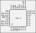
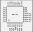
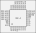

# MBC
This is a selection of details on the memory bank controllers used by Gameboy and Gameboy Color games.

## Addressing
Read/Write subheaders are suffixed with a value in **[** and **]**, this value denotes the required values of the address bits, starting at A15 and proceeding downward.
Only bits available on the given MBC are shown. For example [010x] and [010] are functionally identical, but [010x] has the A12 address pin.

These values provide no additional information, but are a useful shorthand.

# MBC-3
128 switchable ROM banks (2MB, 7 bits).
4 switchable RAM banks (32kB, 2 bits).

## RTC
The MBC-3 contains an Real Time Clock (RTC) circuitry. There are a total of 5 RTC registers.

- **Register 0**: Seconds 0-59
- **Register 1**: Minutes 0-59
- **Register 2**: Hours 0-23
- **Register 3**: Day Counter
- **Register 4**: RTC Flags
  - **Bit 0**: Day Counter (Bit 9)
  - **Bit 6**: 0=RTC Active, 1=RTC Stopped (set to 1 before writing)
  - **Bit 7**: 0=Normal, 1=Day Counter Overflow

## Pinout

**Package:** LQFP-32

## Read
### 0000-3FFF [00x]
Read from Bank 0. (ROM)

### 4000-7FFF [01x]
Switchable ROM bank. Defaults to bank 1.
Can be swapped for any other bank except 0.
Bank is determined by ROM bank register.

### A000-BFFF [101]
External RAM or RTC register. Disabled by default.
Reads are FF when disabled.
Bank is determined by RAM bank register.

## Write
### 0xxx-1xxx [000]
Enable/Disable External RAM. xA enables, anything else disables.

### 2xxx-3xxx [001]
Set ROM bank register.

### 4xxx-5xxx [010]
Set RAM bank register. Values 0 to 7 select RAM bank. Values 8 and above select the RTC registers (starting at register 0).

### 6xxx-7xxx [011]
Writing `00` `01` here will latch or unlatch the RTC registers, which prevents them from changing.
The RTC will continue in the background. RTC registers should be latched before reading.

### A000-BFFF [101]
Write to RAM or RTC register, if enabled.

# MBC-30
An enhancement of the MBC3 used by Japanese Pokemon Crystal version. This functions identically to the MBC-3.
256 switchable ROM banks (4MB, 8 bits).
8 switchable RAM banks (64kB, 3 bits).

## Pinout

**Package:** LQFP-32

# MBC-5
512 switchable ROM banks (9 bits).
16 switchable RAM banks (4 bits).
External RAM enable/disable.

Requires 14 bits of volatile storage for these features.

## Pinout

**Package:** LQFP-32

## Read
### 0000-3FFF [00xx]
Read from Bank 0. (ROM)

### 4000-7FFF [01xx]
Switchable ROM bank. Defaults to bank 1.
Can be swapped for any other bank (including 0).
Bank is determined by ROM bank registers.

### A000-BFFF [101x]
External RAM. Disabled by default.
Reads are FF when disabled.
Bank is determined by RAM bank register.

## Write
### 0xxx-1xxx [000x]
Enable/Disable External RAM. xA enables, anything else disables.

### 2xxx [0010]
Set ROM bank low register. Values are 0-255.

### 3xxx [0011]
Set ROM bank high register. Values are 0-1. (not enough pins for anything more)

### 4xxx-5xxx [010x]
Set RAM bank register.

### A000-BFFF [101x]
Write to RAM if enabled.
